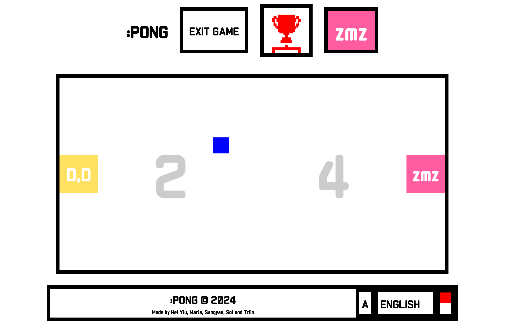

Our ft_transcendence offers a dynamic gaming experience with support for local/remote play, tournament, AI opponents, and classic/balance modes. Its user-friendly features includes Voice Over, multi-language support, a scalable design, and compatibility with multiple devices and browsers.

## Setup

1. Clone the repository

## With docker
2. Run init.sh
   ```
	./init.sh
   ```
3. Open your browser and navigate to https://localhost

4. Your Pong awaits (Only playable as guests)


## If you are a 42 member and want to play with intra login

Have your own 42 API with the redirect URI set to https://[localhost or current domain]/api/request and change the followings in the .env with the corresponding UID and SECRET
```
OAUTH_CLIENT_ID=''
OAUTH_CLIENT_SECRET=''
```

## If you want to enjoy remote play
Change the DOMAIN in the .env to the IP address of a shared network and let users connect to it. If you use 42 API, the redirect URI of the API should change accordingly to https://[new_domain]/api/request. Hover over the sprocket-wheel icon and click 'Edit' to add a new redirect URI on the 42 API setting page.

## When virtual environment is used (defunct)
2. Create and activate a virtual environment:
   ```
	python3 -m venv myenv
	source myenv/bin/activate
   ```
3. Install dependencies:
   ```
	pip install -r requirements.txt
   ```
4. Run migrations:
   ```
	python manage.py migrate
   ```
5. Start the development server:
   ```
	python manage.py runserver
   ```
6. Open your browser and navigate to http://127.0.0.1:8000/
7. Quit the server CONTROL-C
8. Deactivate the virtual environment
    ```
	deactivate
    ```
